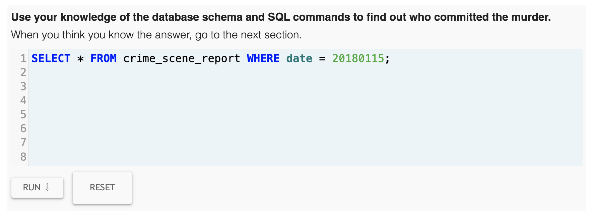
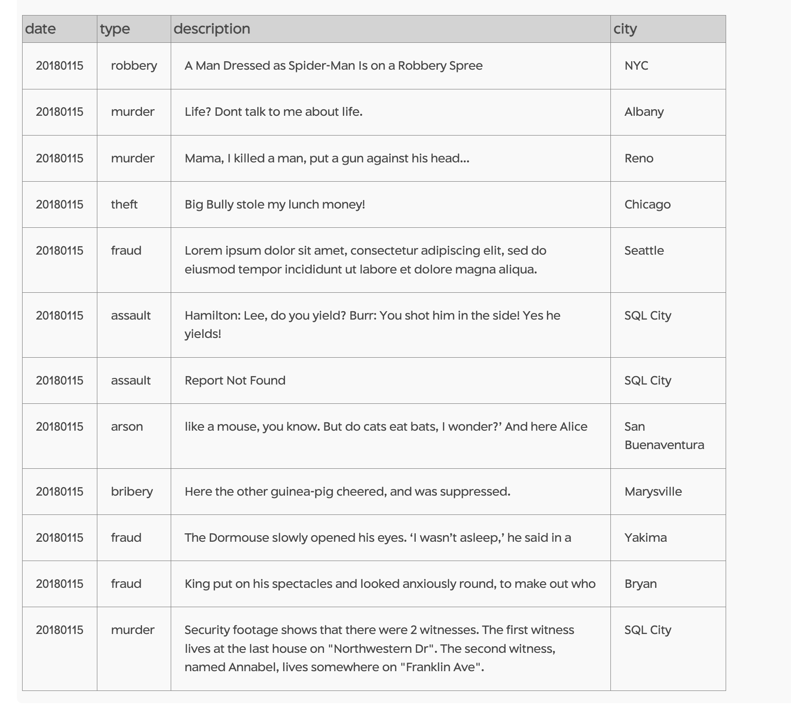
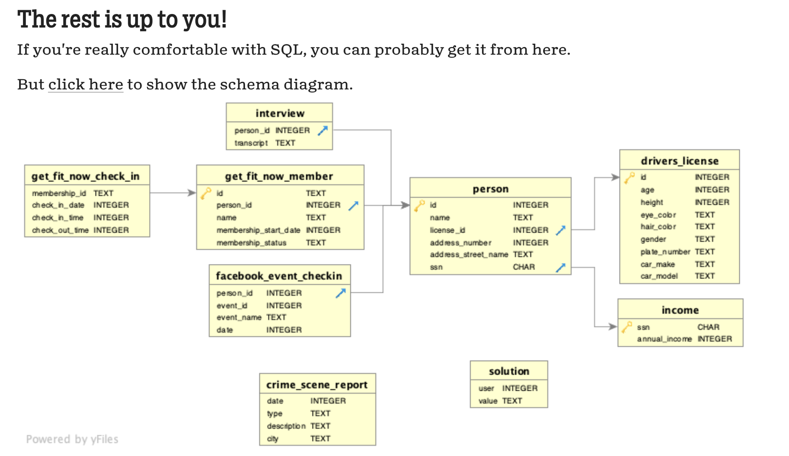
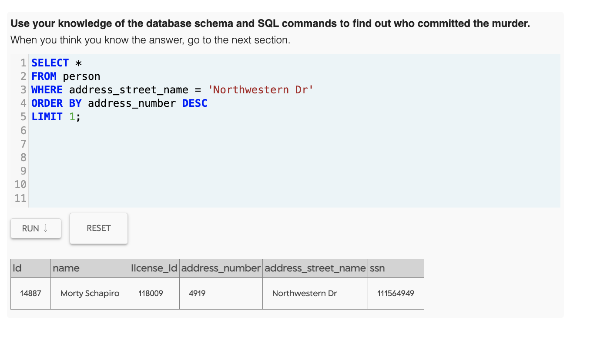
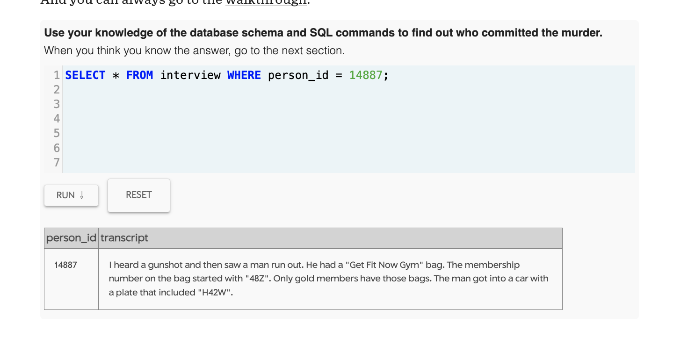
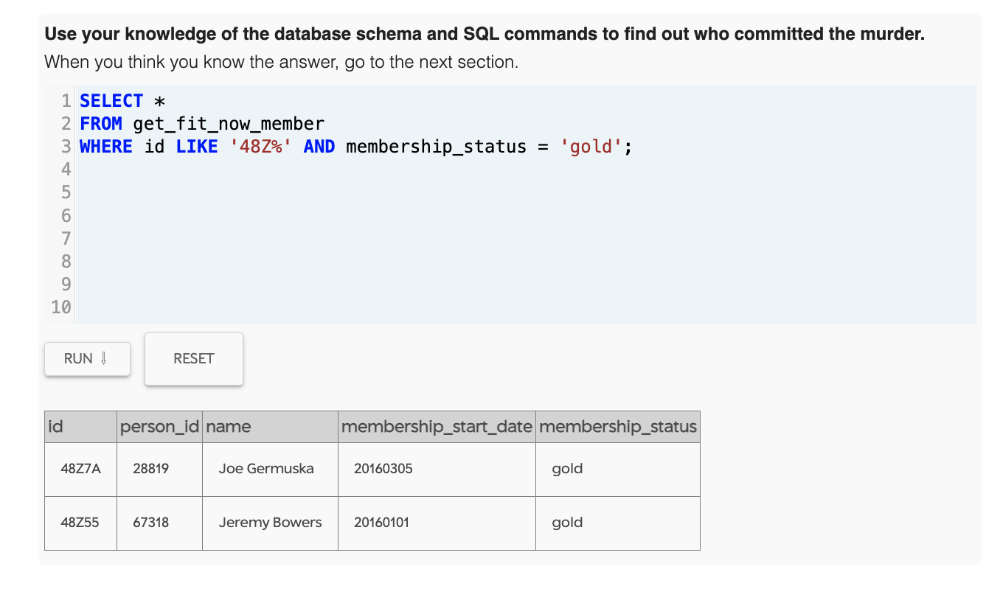
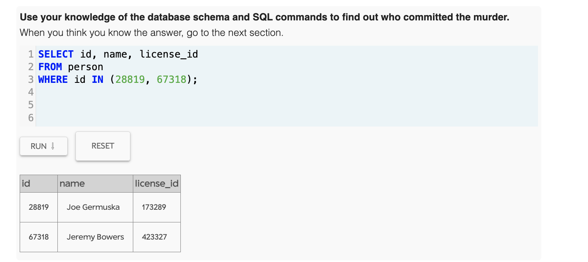
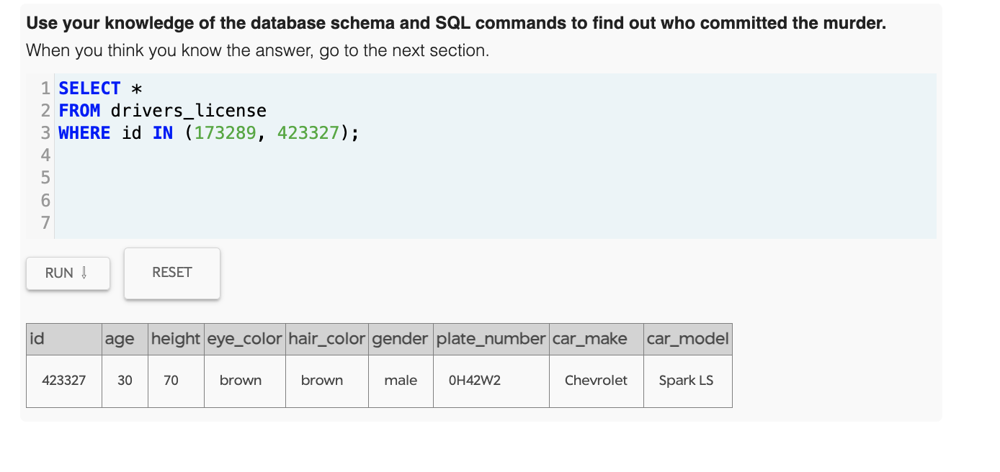
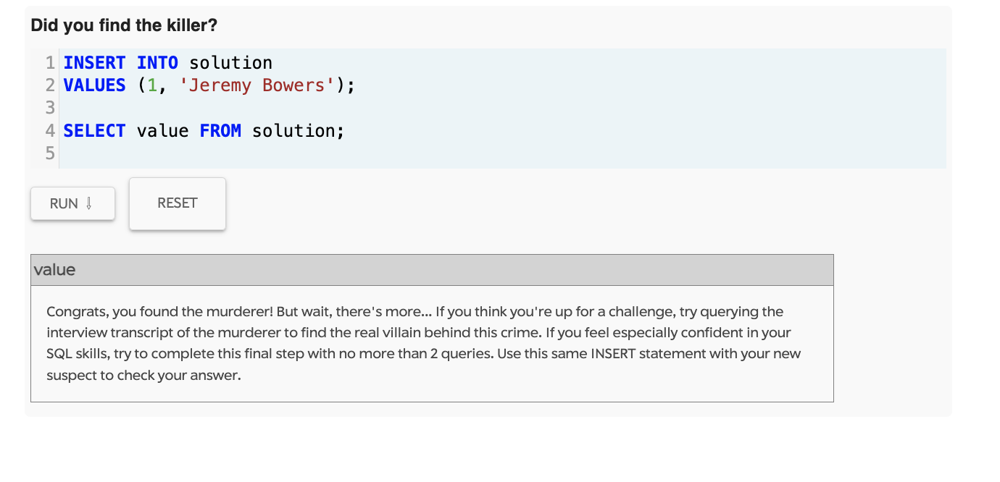

# sql-tc-s12 

## Screenshot 1: Table list

## Screenshot 2: Crime scene report

## Screenshot 3: Table structure

## Screenshot 4: 1st witness address

## Screenshot 5: 1st witness interview report

## Screenshot 6: gold gym members

## Screenshot 7: license id of the two gold gym members

## Screenshot 8: license plate number potentially containing "H42W"

## Screenshot 9: killer found

